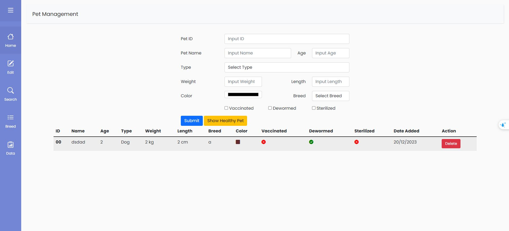

# This is a pet management website, where we can add, edit, and delete a pet.
to run it
- 1. git clone https://github.com/chutrinh/web-pet.git
- 2. cd web-pet
- 3. run at localhost://5500

 with interface
 
