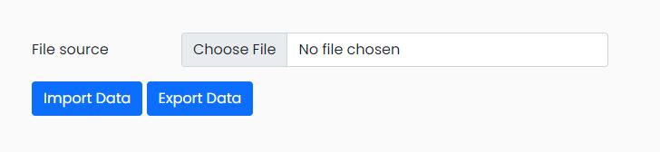

# Web-pet
This is a pet management website, where we can add, edit, and delete a pet.
## Run Locally

Clone the project

```bash
  git clone https://github.com/chutrinh/web-pet.git
```

Go to the project directory

```bash
  cd web-pet

```

Install dependencies

```bash
  npm install
```

Start the server

```bash
  npm start
```

 ### OverView interface
 

### you can import or export file your pet

